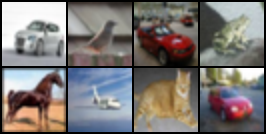
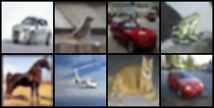
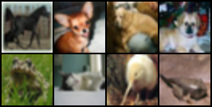
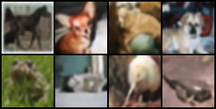

# VQ-VAE: Vector Quantized Variational Autoencoder

This repository provides a modular, from-scratch PyTorch implementation of Vector Quantized Variational Autoencoder (VQ-VAE). VQ-VAE introduces discrete latent spaces using a learnable codebook, enabling efficient and powerful image representations suitable for compression, generation, and downstream modeling tasks.

## 🧠 Overview

Unlike traditional VAEs that use continuous latent variables, VQ-VAE uses a discrete set of embedding vectors. 
During encoding, each latent vector is replaced with its nearest entry in the codebook using vector quantization. 
This results in a discrete bottleneck that is trained via backpropagation using the straight-through estimator. 
The decoder then reconstructs the image from these discrete codes.

## ✅ Final reconstruction loss after 20 epochs: ~0.061 on CIFAR-10.
---

---
## 📊 WandB Logs

All training metrics, including reconstruction visuals and loss curves, are available at:

🔗 https://wandb.ai/atharv3105-dr-a-p-j-abdul-kalam-technical-university/VQ_VAE/runs/pv8vq2cc?nw=nwuseratharv3105

---
## 📚 Reference

This implementation is based on the paper:  
👉 [Neural Discrete Representation Learning (VQ-VAE) – van den Oord et al., 2017](https://arxiv.org/abs/1711.00937)

--- 
## 🧪 Visual Results

Below is a sample of the input images (top row) and their reconstructions (bottom row) after training:

 <strong>Input Images</strong>   
 
 <strong>Reconstructed Images</strong>   

---

 <strong>Input Images</strong>   
 
 <strong>Reconstructed Images</strong>   

